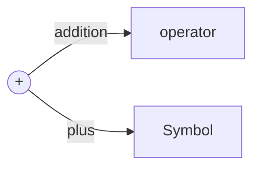
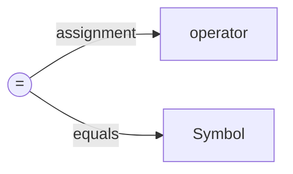
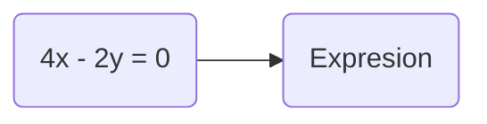

#Assignment Operator
---

Assignment operator is = . It  is used in two ways. It acts as operator to do addition operation and as a symbol to represent positive integers.
###Different meanings of operators
Let's understand by seeing the below images. 


It describes the addition operator to add two numbers. Addition symbol is used to represent the sign of number.

---


It describes the assignment operator to `assign a value to variable`. Variable means its varying, not constant. Also used to check the equality in maths.

---

###Assignment operator
1. It requires two arguments.
1. `Left side` argument must be a `variable`.
1. `Right side` argument can be `variable, constant, expression`.
1. Left side value is called `l-value`.

You have seen equations in maths. In c, there is no equations.

Here it is treated as expression,
&nbsp; x &nbsp; y is varying so it is `variable`
&nbsp; 0 &nbsp; 0 
&nbsp; 2 &nbsp; 4 - fixed values - `constant`

*Combo of variable, constant and operators is called as `expression`.*

####Expresion valid syntax
a = 5;
b = 9 + 2;
b = a;

####Expresion invalid syntax
a = ;
 = 5;
5 = 4; // l-value required

---
###Test your mind

**Problem 1**
What would be the final value of a, b, c, d ?
```
a = 10;
b = 7;
c = 8;
d = 3;
a = b;
b = c;
c = d;
d = a;
```
**Answer**
> a = 7
b = 8
c = 3
d = 7

**Problem 2**
What would be the final value of a, b, c, d ?
```
a = 4 + 3 + 2;
```
**Answer**
> a = 9

---
 You are completed with this post 🥳. Let's move to the next post [Operators](/c-lang/operators)