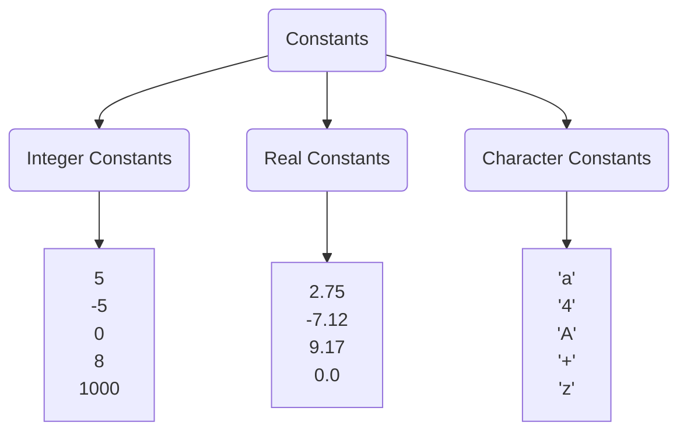

#Difference between English and C language
---
###English vs C

| English      | C Programming | 
| :----        |    :----   |
| Alphabets   - *a,b,c,...z*      | keywords   *int, float, char*     |
| Words  - *more than 10K*        | Operators    *+  - *  / %*        |
| Sentences   - Grammar (set of rules)  :red_circle: 🟡 🟢 | Separators   *; { }* |

- `Keywords` are like alphabets in english language. keywords are `reserved words` meant for specific purpose.
- `Operators` are used to perform `computation`. They are like words in English. This is used to construct the words.
- `Separator` are used to break into lines like `full stops` in english.

###Constants 

They are classified into `Integer` , `real`, `Character` constants.
- `Integers constants` are numbers like count of chocalates but it can be in both `positive` and `negative`
- `Real constants` are numbers with floating points. Floating means the number is `not fixed and floats` so it is called floating point.
- `Character constants` are `single characters` within single quotes 

Examples of invalid character constants: 'Hi' ,'9.0','Ritche'

---
 You are completed with this post 🥳. Let's move to the next post [Assignment Operator]("https://codextrees.herokuapp.com/c-lang/assignment-operator")